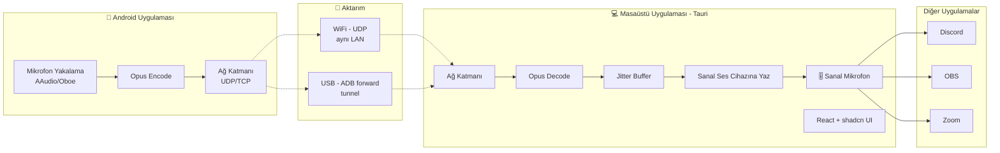

# 🎙️ microhone — Proje Planı & Teknik Spec

> **Tek cümlelik özet:** Telefonun mikrofonunu, bilgisayarda gerçek bir mikrofon cihazı gibi kullanmanı sağlayan; WiFi ve USB üzerinden çalışan, masaüstü + mobil + landing site'tan oluşan bir sistem.

> **Domain:** microhone.com (alındı ✅)
> **İsim notu:** "micro + hone" / "microphone" kelimesinin oyunu. Marka dili buna oynayabilir (hone = bilemek/keskinleştirmek → "mikrofonunu keskinleştir" gibi).

Bu doküman, Claude (Code) ile birlikte projeyi adım adım kurmak için hazırlanmıştır. Her bölüm bir karar noktası ya da inşa edilecek bir parça içerir.

---

## 0. İçindekiler

1. [Vizyon & Kullanım Senaryoları](#1-vizyon--kullanım-senaryoları)
2. [Özellikler (MVP vs Sonraki)](#2-özellikler-mvp-vs-sonraki)
3. [Sistem Mimarisi](#3-sistem-mimarisi)
4. [Teknoloji Yığını (Tech Stack)](#4-teknoloji-yığını-tech-stack)
5. [⚠️ En Kritik Mesele: Sanal Mikrofon](#5-️-en-kritik-mesele-sanal-mikrofon)
6. [Ses Pipeline'ı & Gecikme (Latency)](#6-ses-pipelineı--gecikme-latency)
7. [Bağlantı: WiFi Keşfi, USB ve Eşleştirme](#7-bağlantı-wifi-keşfi-usb-ve-eşleştirme)
8. [İletişim Protokolü Tasarımı](#8-i̇letişim-protokolü-tasarımı)
9. [Mobil Uygulama (Android)](#9-mobil-uygulama-android)
10. [Masaüstü Uygulama (PC)](#10-masaüstü-uygulama-pc)
11. [Landing Site (microhone.com)](#11-landing-site-microhonecom)
12. [Proje Yapısı (Monorepo)](#12-proje-yapısı-monorepo)
13. [Yol Haritası (Faz Faz)](#13-yol-haritası-faz-faz)
14. [Riskler & Zor Noktalar](#14-riskler--zor-noktalar)
15. [Verilmesi Gereken Kararlar](#15-verilmesi-gereken-kararlar)
16. [⚙️ Çalışma Akışı & Commit Kuralları](#16-️-çalışma-akışı--commit-kuralları)

> **🔴 CLAUDE İÇİN ÖNEMLİ NOT:** Her işlemi bitirdikten sonra [Bölüm 16'daki](#16-️-çalışma-akışı--commit-kuralları) kurala göre bir commit mesajı ver. Bu kuralı tüm proje boyunca uygula.

---

## 1. Vizyon & Kullanım Senaryoları

İnsanlar bunu **neden** kullanır? (Latency hedeflerini bu belirler)

| Senaryo | Gecikme toleransı | Not |
|---|---|---|
| Discord / Zoom / Teams sesli görüşme | ~100ms ok | En yaygın kullanım. WiFi yeter. |
| Yayın / kayıt (OBS, podcast) | ~100ms ok | Telefon mikrofonu bazen webcam mikrofonundan iyi. |
| Oyun içi sesli sohbet | <80ms iyi | Düşük gecikme önemli. |
| **Canlı kendini dinleme (şarkı/monitoring)** | **<30ms şart** | **WiFi'de neredeyse imkânsız → USB modu gerekir.** |

> **Karar:** İlk hedef kitle "sesli görüşme + yayın". Canlı monitoring'i "USB modunda mümkün" diye konumlandır, WiFi'de vaat etme.

---

## 2. Özellikler (MVP vs Sonraki)

### MVP (v1.0) — "Çalışan en küçük ürün"
- [ ] Android telefondan ses yakalama
- [ ] WiFi (aynı ağ) üzerinden PC'ye düşük gecikmeli ses aktarımı
- [ ] PC'de sanal mikrofon olarak görünme (Discord/OBS seçebilsin)
- [ ] Otomatik cihaz keşfi (telefon PC'yi ağda bulsun)
- [ ] QR / PIN ile eşleştirme (güvenlik)
- [ ] Temel masaüstü GUI: bağlı cihaz, ses seviyesi göstergesi, başlat/durdur
- [ ] Temel mobil UI: bağlan, mute, seviye göstergesi

### v1.1
- [ ] USB modu (ADB forward üzerinden, düşük gecikme)
- [ ] Opus codec ile bant genişliği + paket kaybı dayanıklılığı
- [ ] Gain/seviye ayarı, gürültü kapısı (noise gate)

### v2.0+
- [ ] **Kendi imzalı sanal ses sürücüsü** (üçüncü parti VB-Cable bağımlılığını kaldır)
- [ ] macOS + Linux desteği
- [ ] iOS uygulaması
- [ ] Gürültü engelleme (RNNoise / yapay zeka tabanlı)
- [ ] Çoklu cihaz (birden fazla telefonu kanal olarak ekleme)
- [ ] Otomatik güncelleme

---

## 3. Sistem Mimarisi



**Akış özeti:** Telefon mikrofonu yakalar → Opus ile sıkıştırır → ağ üzerinden (WiFi UDP veya USB tunnel) PC'ye yollar → PC çözer → jitter buffer'dan geçirir → sanal ses cihazına yazar → Discord/OBS bu cihazı "mikrofon" olarak görür.

---

## 4. Teknoloji Yığını (Tech Stack)

### 📱 Mobil (Android — öncelik)
| Katman | Seçim | Neden |
|---|---|---|
| Dil | **Kotlin** | Modern Android standardı |
| UI | **Jetpack Compose** | Modern, declarative |
| Ses yakalama | **AAudio / Oboe** | En düşük gecikmeli capture (AudioRecord daha basit ama yüksek gecikme) |
| Codec | **libopus** (NDK/JNI) | Düşük gecikme + paket kaybı toleransı |
| Ağ | Ham UDP/TCP socket veya **Ktor** | Kontrol gerektirir |
| QR tarama | **CameraX + ML Kit** | Eşleştirme için |
| Keşif | **NsdManager** (mDNS) | PC'yi ağda bulmak |

### 💻 Masaüstü (PC)
| Katman | Seçim | Neden |
|---|---|---|
| Çerçeve | **Tauri 2.x** | Rust çekirdek + web UI. Electron'dan çok hafif, native ses/ağ işine Rust uygun |
| UI | **React + Vite + Tailwind + shadcn/ui** | Modern, senin istediğin görünüm. (Next.js masaüstü için fazla ağır — siteyi Next ile yap, masaüstünü Vite ile) |
| Ses I/O | **cpal** (Rust) | Çapraz platform ses giriş/çıkış |
| Codec | **opus / audiopus** (Rust) | Decode |
| Ağ | **tokio** | Async ağ |
| Keşif | **mdns-sd** (Rust) | Servis yayını |
| USB | `adb forward` çağrısı | Tunnel |

> **Neden Tauri, Electron değil?** Bu uygulamanın çekirdeği gerçek-zamanlı ses + ağ + sürücü etkileşimi — bunlar için Rust ideal. Electron'da bu işleri native modüllerle yapmak daha sancılı, hem de 150MB+ boyut. Tauri ~5-10MB. Modern UI'dan da ödün vermezsin (yine React + shadcn).

### 🌐 Site (microhone.com)
| Katman | Seçim |
|---|---|
| Çerçeve | **Next.js 15 (App Router) + TypeScript** |
| Stil | **Tailwind + shadcn/ui** |
| Bileşen ilhamı | **21st.dev**, shadcn blocks, Aceternity UI |
| Animasyon | Framer Motion |
| Deploy | **Vercel** |
| Analytics | Vercel Analytics / Plausible |

---

## 5. ⚠️ En Kritik Mesele: Sanal Mikrofon

**Bu projenin en zor ve en çok hafife alınan parçası budur. Önce bunu çözmeden başlama.**

Discord/Zoom/OBS'in mikrofon listesinde "microhone" görünmesi için, işletim sistemine **sanal bir ses YAKALAMA (capture) cihazı** tanıtman gerekir. Bu platforma göre çok değişir:

### Windows (en zor)
- Gerçek bir sanal mikrofon için **kernel-mode ses sürücüsü** lazım. Microsoft'un **SysVAD** örnek sürücüsünü temel alabilirsin.
- **Sorun:** Sürücünün imzalanması gerekir → EV sertifikası (~yıllık $200-400) + Microsoft attestation imzalama. Bu, ciddi bir engel ve maliyet.
- **MVP stratejisi:** Başta kendi sürücünü yazma. **VB-CABLE** (ücretsiz sanal ses kablosu) bağımlılığı ile başla:
  - PC uygulaması sesi VB-Cable'ın "input"una yazar.
  - Kullanıcı Discord'da "CABLE Output"u mikrofon seçer.
  - Dezavantaj: ayrı kurulum, marka senin değil ("CABLE Output" yazar).
- **v2 hedefi:** Kendi imzalı sürücünü yaz, "microhone Microphone" diye görünsün.

### macOS (orta)
- **AudioServerPlugin (HAL plugin)** ile sanal cihaz yapılır — **kernel extension gerekmez**, user-space çalışır (Windows'tan kolay).
- Açık kaynak **BlackHole**'u temel alabilir veya bağımlılık olarak kullanabilirsin.
- Yine de imzalama + notarization gerekir ama daha hafif.

### Linux (kolay)
- **PipeWire** veya **PulseAudio** ile tek komutta sanal kaynak:
  ```bash
  pactl load-module module-null-sink sink_name=microhone
  # veya PipeWire ile null sink + virtual source
  ```
- Sürücü/imza derdi yok.

> **Yol haritası kararı:** Önce **Linux'ta** PoC yap (en kolay), sonra **Windows + VB-Cable**, en son **kendi imzalı sürücü**. Bu sıra seni erken motive eder ve riski geciktirir.

---

## 6. Ses Pipeline'ı & Gecikme (Latency)

Toplam gecikme = bu adımların toplamı. Hedef: WiFi'de **50-100ms**, USB'de **<50ms**.

| Adım | Tahmini gecikme | Not |
|---|---|---|
| Mikrofon yakalama buffer'ı | ~10ms | AAudio low-latency mode |
| Opus encode | ~10-20ms | Frame boyutu = gecikme/kalite dengesi (10ms frame öner) |
| Ağ (WiFi LAN) | ~2-10ms | **Jitter asıl düşman** |
| **Jitter buffer (PC)** | ~20-40ms | Ayarlanabilir: düşük=glitch riski, yüksek=gecikme |
| Opus decode | ~5ms | |
| Sanal cihaza yazma + OS çıkış buffer'ı | ~10-20ms | |
| **Toplam (WiFi)** | **~60-100ms** | Sesli görüşme için sorun değil |

**Ses formatı:**
- Örnekleme: **48 kHz** (modern standart, çoğu uygulama bunu bekler)
- Bit derinliği: 16-bit
- Kanal: Mono (mikrofon için yeterli, bant genişliği yarı)
- Codec: **Opus** (WiFi'de). USB'de bant genişliği bol → istersen ham PCM da olur.

**Önemli teknikler:**
- **Adaptive jitter buffer:** ağ koşuluna göre kendini ayarlasın.
- **Opus PLC (Packet Loss Concealment):** kayıp paketleri gizle, ses kesilmesin.
- Sequence number + timestamp her pakette → sıralama ve kayıp tespiti.

---

## 7. Bağlantı: WiFi Keşfi, USB ve Eşleştirme

### WiFi Modu
- Telefon ve PC **aynı ağda** olmalı.
- **Keşif:** mDNS/Zeroconf. PC kendini `_microhone._tcp` servisi olarak yayınlar; telefon ağda tarar ve PC'yi listede gösterir.
- **Dikkat:** Bazı router'larda **AP isolation** açıktır → cihazlar birbirini göremez. Bunu kullanıcıya hata mesajıyla açıkla. Manuel IP girme seçeneği de koy (fallback).
- Firewall: PC uygulaması portu açmalı / kullanıcıyı uyarmalı.

### USB Modu (düşük gecikme)
- Yöntem: **ADB port forwarding** (scrcpy ve WO Mic'in yaptığı). 
  ```bash
  adb forward tcp:<port> tcp:<port>
  ```
  Böylece USB üzerinden TCP tünel kurulur, aynı ağ kodun çalışır (sadece `localhost`'a bağlanır).
- **Gereksinim:** telefonda **USB hata ayıklama (debugging)** açık olmalı. Bu bir UX maliyeti — kurulum sihirbazında adım adım anlat.
- Alternatif: USB tethering (RNDIS arayüzü) → ama ADB forward daha güvenilir.
- PC uygulaması `adb`'yi bundle edebilir (kullanıcı ayrı kurmasın).

### Eşleştirme & Güvenlik
- Rastgele birinin bağlanmaması için **eşleştirme** şart.
- **Yöntem:** PC ekranda **QR kod** gösterir → içinde `{host, port, token/pubkey}`. Telefon kamerayla tarar → oturum kurulur. Alternatif: 6 haneli **PIN**.
- **Şifreleme:** modern bir güvenli kanal — **Noise Protocol** veya **libsodium** ile uçtan uca. En azından ham UDP üzerine AES + el sıkışma.
- Eşleştirilmiş cihazları hatırla (bir daha QR taramasın).

---

## 8. İletişim Protokolü Tasarımı

İki kanal kullan:

### Kontrol kanalı (TCP)
El sıkışma, eşleştirme, ayar (sample rate, codec, başlat/durdur), keepalive. Mesajlar JSON veya küçük binary (protobuf/MessagePack).

```
HELLO        → istemci kendini tanıtır (versiyon, yetenekler)
PAIR_REQ     → token/PIN ile eşleştirme
CONFIG       → {sampleRate: 48000, codec: "opus", frameMs: 10}
START / STOP → akışı başlat/durdur
PING / PONG  → keepalive
```

### Ses kanalı (UDP — WiFi'de)
Gerçek zamanlı ses paketleri. Her paket:

```
[ seq:u32 ][ timestamp:u32 ][ opus_payload:bytes ]
```
- `seq` → sıralama & kayıp tespiti
- `timestamp` → jitter buffer hizalama
- USB modunda TCP üzerinden (ADB forward) → sıralama garantili, jitter buffer daha küçük olabilir.

> **Not:** Protokolü `packages/protocol` altında **tek bir spec dosyası** olarak tut. Hem Kotlin hem Rust tarafı bu speci referans alsın. Versiyonlama koy (ileri uyumluluk).

---

## 9. Mobil Uygulama (Android)

### Kritik teknik noktalar
- **Foreground Service şart:** Ekran kapalıyken / arka planda ses yakalamaya devam için kalıcı bildirimli foreground service gerekir. Aksi halde Android servisi öldürür.
- **Doze / pil optimizasyonu:** kullanıcıdan pil optimizasyonundan muaf tutmasını iste.
- **İzinler:** `RECORD_AUDIO`, `INTERNET`, `FOREGROUND_SERVICE`, `FOREGROUND_SERVICE_MICROPHONE` (Android 14+), kamera (QR için).
- **Audio focus & echo cancellation:** AEC/NS efektlerini kullanmak isteyebilirsin (`AcousticEchoCanceler`), ama bunlar gecikme ekleyebilir — opsiyonel yap.

### Ekranlar (Compose)
1. **Bağlan** — ağda bulunan PC'ler listesi + QR tara + manuel IP
2. **Aktif** — büyük mute butonu, ses seviyesi (VU meter), bağlantı tipi (WiFi/USB), gecikme göstergesi
3. **Ayarlar** — gain, gürültü kapısı, codec, eşleştirilmiş cihazlar

---

## 10. Masaüstü Uygulama (PC)

### Rust çekirdek sorumlulukları
- mDNS yayını (`_microhone._tcp`)
- TCP kontrol sunucusu + UDP ses sunucusu
- Opus decode → jitter buffer → cpal ile sanal cihaza yazma
- ADB forward yönetimi (USB modu)
- Eşleştirme/şifreleme

### UI (React + shadcn)
- **Ana ekran:** bağlı telefon kartı, canlı VU meter, bağlantı tipi, "Sanal mikrofon: microhone ✅" durumu
- **İlk kurulum sihirbazı:** sanal sürücü kurulumu (VB-Cable indir/kur adımı), USB debugging anlatımı
- **Ayarlar:** çıkış cihazı seçimi, jitter buffer boyutu, otomatik başlat
- **QR kod gösterimi** (eşleştirme için)

> **UX kuralı:** Sanal sürücü kurulumu kullanıcıyı kaybedeceğin yer. Sihirbazı çok net yap, tek tık indirme/kurma hedefle.

---

## 11. Landing Site (microhone.com)

### Yapı
1. **Hero** — net başlık ("Telefonun, PC'nin mikrofonu olsun"), platform algılayan indirme butonu, ürünün görseli/animasyonu
2. **Nasıl çalışır** — 3 adım: İndir → Eşleştir (QR) → Konuş
3. **Özellikler** — düşük gecikme, WiFi & USB, Discord/OBS/Zoom uyumlu, ücretsiz/açık kaynak (?)
4. **Demo / GIF** — gerçek kullanım
5. **İndirme** — Windows/macOS/Linux + Android (Play Store / APK)
6. **SSS** — gecikme? güvenli mi? hangi uygulamalarla çalışır?
7. **Footer** — GitHub, gizlilik, iletişim

### Tasarım dili
- Modern, koyu tema ağırlıklı (ses/teknoloji ürünleri genelde koyu)
- 21st.dev ve Aceternity'den hero animasyonları (ışıltılı gradient, ses dalgası animasyonu — mikrofon teması)
- shadcn bileşenleri, Framer Motion ile mikro-etkileşimler
- Ses dalgası (waveform) motifi → marka kimliğine otur

---

## 12. Proje Yapısı (Monorepo)

```
microhone/
├── apps/
│   ├── site/          # Next.js 15 — microhone.com
│   ├── desktop/       # Tauri (Rust + React/shadcn)
│   └── mobile/        # Android (Kotlin + Compose)
├── packages/
│   ├── protocol/      # Protokol spec (her iki taraf referans alır)
│   └── ui/            # site + desktop arası ortak shadcn bileşenleri
├── drivers/
│   ├── windows/       # sanal ses sürücüsü (v2)
│   └── macos/         # AudioServerPlugin (v2)
├── README.md
└── microhone-plan.md  # bu doküman
```
- **pnpm workspaces** + **Turborepo** (site & desktop JS tarafı için)
- Android ayrı Gradle projesi, Tauri'nin Rust'ı kendi Cargo'su

---

## 13. Yol Haritası (Faz Faz)

> Her fazı Claude ile ayrı oturumda yapman önerilir. Her faz "çalışan bir şey" üretmeli.

| Faz | Hedef | Çıktı |
|---|---|---|
| **0. Kurulum** | Monorepo, repo, CI | Boş ama derlenen iskelet |
| **1. Ses PoC** | Android yakala → UDP → Rust CLI → **PC hoparlöründen çal** | Capture+aktarım+çalma kanıtlandı. Henüz sanal cihaz/UI yok |
| **2. Sanal mikrofon** | Sesi sanal cihaza yaz (önce Linux null-sink, sonra Windows + VB-Cable) | Discord'da "microhone" seçilebiliyor 🎉 |
| **3. Codec & kalite** | Opus + jitter buffer + gecikme ayarı | Akıcı, düşük gecikmeli ses |
| **4. Keşif & eşleştirme** | mDNS + QR/PIN + şifreleme | Otomatik bulma, güvenli bağlantı |
| **5. USB modu** | ADB forward tüneli | Düşük gecikme USB modu |
| **6. UI cilası** | Tauri masaüstü GUI + Compose mobil UI | Gerçek ürün hissi |
| **7. Site** | microhone.com | İndirme + tanıtım |
| **8. Kendi sürücün** | İmzalı Windows sürücüsü + notarized mac plugin | Üçüncü parti bağımlılığı kalktı |
| **9. Paketleme** | Installer, imzalama, auto-update, release | Dağıtıma hazır |

---

## 14. Riskler & Zor Noktalar

| Risk | Etki | Önlem |
|---|---|---|
| **Windows sürücü imzalama** maliyeti/zorluğu | Yüksek | MVP'de VB-Cable bağımlılığı; kendi sürücüsünü v2'ye ertele |
| **WiFi jitter / gecikme** | Orta | Adaptive jitter buffer, Opus PLC, USB alternatifi |
| **Router AP isolation / firewall** | Orta | Net hata mesajı + manuel IP fallback |
| **Android arka plan kısıtları** | Orta | Foreground service + pil muafiyeti yönlendirmesi |
| **Pil tüketimi** (sürekli yakalama+ağ) | Düşük-Orta | Verimli codec, uyku optimizasyonu |
| **Android sürüm parçalanması** | Düşük | AAudio min API kontrolü, AudioRecord fallback |
| **USB debugging UX engeli** | Orta | Çok iyi anlatılmış sihirbaz; WiFi'yi varsayılan yap |

---

## 15. Verilmesi Gereken Kararlar

İnşaya başlamadan önce bunlara karar ver (Claude'a hangi yöne gideceğini söylersin):

1. **Hangi platform önce?** → Öneri: **Windows-first** (en geniş kitle), ama PoC için Linux daha kolay.
2. **Açık kaynak mı, kapalı mı?** → Açık kaynak güven + topluluk getirir (rakip WO Mic kapalı). microhone'u açık kaynak + opsiyonel "pro" özellikler modeli düşünebilirsin.
3. **Ücretsiz mi / gelir modeli?** → Ücretsiz çekirdek, pro özellikler (gürültü engelleme, çoklu cihaz) ücretli olabilir.
4. **Masaüstü çerçeve:** Tauri (öneri) onaylanıyor mu?
5. **iOS ne zaman?** → APK öncelikli dedin; iOS'u v2 olarak işaretledim.
6. **İlk codec:** Doğrudan Opus mı, yoksa PoC için ham PCM mı? → Öneri: PoC'de ham PCM (basitlik), sonra Opus.

---

## 16. ⚙️ Çalışma Akışı & Commit Kuralları

> **Bu bölüm Claude için bir talimattır. Tüm proje boyunca her oturumda geçerlidir.**

### Akış
- **Commit ata ata ilerliyoruz.** Her mantıksal işlem/parça bitince ayrı bir commit atılacak.
- **Bir işlemi (özellik, düzeltme, refactor, dosya kurulumu vb.) bitirdikten sonra Claude bana SADECE commit mesajını verecek.** Açıklama, özet, "şunu yaptım" gibi ekstra metin yok — sadece kopyalayıp yapıştıracağım commit mesajı.
- Mesajı kod bloğu içinde ver ki tek tıkla kopyalayabileyim.

### Commit mesajı formatı (Conventional Commits + detaylı gövde)

```
<type>(<scope>): <kısa özet>

* <yapılan değişiklik 1>
* <yapılan değişiklik 2>
* <yapılan değişiklik 3>
```

**Kurallar:**
- Başlık (ilk satır) **72 karakteri geçmesin**, küçük harfle başlasın, sonunda nokta olmasın.
- Başlıktan sonra **bir boş satır**, ardından `*` ile başlayan madde madde gövde.
- Gövde maddeleri **ne yapıldığını** net ve açıklayıcı anlatsın (modern, okunabilir).
- İngilizce yazılacak (commit'ler genelde İngilizce; istersen bana söyle, Türkçe'ye çeviririm).

**Type listesi:**
| type | ne zaman |
|---|---|
| `feat` | yeni özellik |
| `fix` | hata düzeltme |
| `refactor` | davranışı değiştirmeyen kod düzenleme |
| `chore` | yapılandırma, bağımlılık, araç işleri |
| `docs` | dokümantasyon |
| `style` | format/biçim (mantık değişmez) |
| `perf` | performans iyileştirme |
| `test` | test ekleme/düzenleme |
| `build` | derleme/paketleme sistemi |
| `ci` | CI/CD ayarları |

**Scope örnekleri (bu proje için):** `mobile`, `desktop`, `site`, `protocol`, `driver`, `audio`, `network`, `repo`

### Örnek commit mesajları

```
feat(audio): add raw PCM capture pipeline on Android

* implement AAudio low-latency input stream via Oboe
* add ring buffer between capture callback and network thread
* expose configurable sample rate (default 48kHz mono)
* add RECORD_AUDIO permission handling and runtime request
```

```
feat(network): stream captured audio to desktop over UDP

* add UDP socket sender with sequence numbers and timestamps
* implement basic packet framing for the audio channel
* add target host/port configuration from pairing data
```

```
chore(repo): bootstrap monorepo skeleton

* set up pnpm workspaces and turborepo config
* scaffold apps/mobile (Kotlin + Compose) and apps/desktop (Tauri + React)
* add shared packages/protocol placeholder
* configure base eslint, prettier and .gitignore
```

```
fix(desktop): prevent audio glitches under network jitter

* add adaptive jitter buffer with configurable target latency
* enable Opus packet loss concealment for dropped packets
* clamp buffer growth to avoid runaway latency
```

---

## 🚀 Hemen Başlangıç (Claude'a ilk söyleyebileceğin şey)

> "microhone projesinin Faz 0 ve Faz 1'ini yapalım. Monorepo iskeletini kur (pnpm + turborepo), `apps/mobile` için Kotlin+Compose Android iskeleti, `apps/desktop` için Tauri+React+shadcn iskeleti oluştur. Sonra Faz 1: Android'in mikrofonu ham PCM olarak yakalayıp UDP ile yolladığı, Rust tarafının da bunu alıp PC hoparlöründen çaldığı en basit PoC'yi yazalım."

Bu PoC çalışınca projenin kalbi kanıtlanmış olur; gerisi onun üstüne inşa.

---

*Doküman versiyonu: v1 — microhone planlama*
